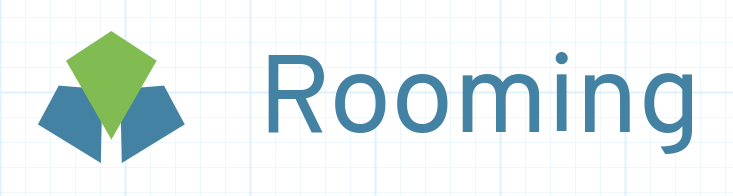

# Rooming 

*Este repositorio contendrá el proyecto realizado en la asignatura Cloud Computing durante el curso 2020-2021.* 

### Documentación del proyecto

- :bulb: Descripción del proyecto. [Descripción](https://aguilera4.github.io/Rooming/docs/descripcion_rooming)
- :triangular_ruler: Arquitectura y herramientas utilizadas. [Arquitectura](https://aguilera4.github.io/Rooming/docs/arquitectura)
- :pencil:Milestone y *issues*. [Milestone](https://aguilera4.github.io/Rooming/docs/milestone)
- :wrench: Roadmap. [Roadmap](https://aguilera4.github.io/Rooming/docs/roadmap)
- :hammer: Configuración del proyecto. [Configuracion](https://aguilera4.github.io/Rooming/docs/README)

### Documentación en desarrollo

- Herramienta de gestor de tareas seleccionado. [Gestor de tareas](https://github.com/Aguilera4/Rooming/blob/hito_2/docs/gestor_tareas.md)
- Descripción y justificación de la biblioteca de aserción utilizada. [Biblioteca de aserción](https://github.com/Aguilera4/Rooming/blob/hito_2/docs/descripcion_assert.md)
- Marco de pruebas. [Marco](https://github.com/Aguilera4/Rooming/blob/hito_2/docs/descripcion_tests.md)

### Clases Implementadas

Aqui se incluyen algunas [clases](https://github.com/Aguilera4/Rooming/tree/main/src) implementadas.

### Información adicional

Porque utilizar NodeJS. [Información](https://relevant.software/blog/7-benefits-of-node-js-for-startups/)