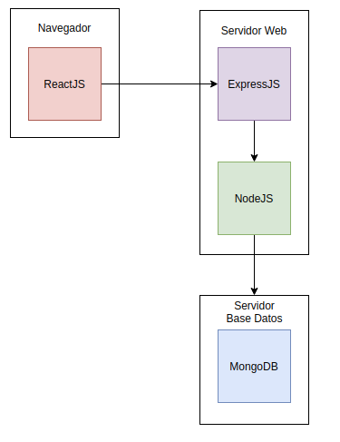

# Rooming

*Este repositorio contendrá el proyecto realizado en la asignatura Cloud Computing durante el curso 2020-2021.* 

## Arquitectura

***Romming*** tendrá una arquitectura software basada en capas. Esta arquitectura permite cambios en las diferentes capas a un nivel de gran abstración, además, el diseño de esta arquitectura define con gran claridad la separación entre la funcionalidad de cada capa. Asimismo, las capas de nivel inferior no tienen ningun grado de dependencia de las capas superiores aportando a estas una gran reutilización.

Esta arquitectura se dividirá en tres capas:

- **Presentación (Navegador)**: relacionada con el lado del cliente (front-end).
- **Servidor web**: se defienirá todo el enrutamiento del proyecto, así como todo el proceso de peticiones y respuestas.
- **Servidor Base de datos**: implementarán toda la parte de acceso a los datos. 

Para el desarrollo de esta aplicación, voy a utilizar una tecnología que no había empleado anteriormente pero que tengo un gran interés sobre su funcionamiento, ya que por la información que se puede recavar de Internet tiene un gran potencial para el desarrollo de aplicaciones. En concreto, voy a utilizar el framework o conjunto de subsistemas conocido como ***MERN Stack***, basado en el lenguaje de programación **JavaScript**. MERN Stack utiliza la librería ***ReactJS*** para la parte del ***front-end*** (aunque en este proyecto no se utiliza). Además, utiliza ***ExpressJS*** y ***NodeJS*** para la parte del servidor web (enrutamientos, peticones, respuestas, etc) y por último ***MongoDB*** para la parte backend de nuestra aplicación.

## Plan de desarrollo

- [Estructuración del Proyecto](https://github.com/Aguilera4/Rooming/milestone/2)
    
    - [Subir las primeras clases del proyecto.](https://github.com/Aguilera4/Rooming/issues/8)
    - [Crear fichero de identificación yml para las clases sin código.](https://github.com/Aguilera4/Rooming/issues/14)
    - [Subir información concreta de la arquitectura](https://github.com/Aguilera4/Rooming/issues/7)
    - [Subir imagen de la arquitectura empleada.](https://github.com/Aguilera4/Rooming/issues/20)
    - [Crear las historias de usuario.](https://github.com/Aguilera4/Rooming/issues/9)

- [Usuarios](https://github.com/Aguilera4/Rooming/milestone/5)

    - [HU - Como usuario, necesito logearme en la aplicación.](https://github.com/Aguilera4/Rooming/issues/10)
    - [HU - Como usuario, necesito registrarme en la aplicación.](https://github.com/Aguilera4/Rooming/issues/19)
    - [HU - Como usuario inscrito a una oferta, necesito tener la posibilidad de borrarme de la misma.](https://github.com/Aguilera4/Rooming/issues/15)
    - [HU - Como usuario, necesito inscribirme o solicitar una habitación.](https://github.com/Aguilera4/Rooming/issues/12)

- [Rooms](https://github.com/Aguilera4/Rooming/milestone/6)

    - [HU - Como usuario, necesito modificar la información de una vivienda.](https://github.com/Aguilera4/Rooming/issues/17)
    - [HU - Como creador de un post, necesito eliminarlo.](https://github.com/Aguilera4/Rooming/issues/16)
    - [HU - Como usuario, necesito crear un nuevo post de vivienda o habitación. ](https://github.com/Aguilera4/Rooming/issues/11)

- [ChatRoom](https://github.com/Aguilera4/Rooming/milestone/7)

    - [HU - Como usuario, necesito comentar en una habtiación.](https://github.com/Aguilera4/Rooming/issues/13)
    - [HU - Como administrador, necesito eliminar aquellos mensajes indevidos.](https://github.com/Aguilera4/Rooming/issues/21)

- [Puesta en producción y posicionamiento en la nube](https://github.com/Aguilera4/Rooming/milestone/4)

    - [Pensar la viabilidad para el despliege](https://github.com/Aguilera4/Rooming/issues/22)
    - [Desplegar la APP en la nube.](https://github.com/Aguilera4/Rooming/issues/18)

## Información adicional

Enlace a la [descripción del proyecto](https://github.com/Aguilera4/Rooming/blob/main/docs/descripcion_rooming.md).

Sobre [MERN Stack](https://www.mongodb.com/mern-stack).
Sobre [arquitectura basada en capas](https://geeks.ms/jkpelaez/2009/05/30/arquitectura-basada-en-capas/#:~:text=La%20arquitectura%20basada%20en%20capas,funcionalidad%20que%20est%C3%A1%20siendo%20desarrollada.)