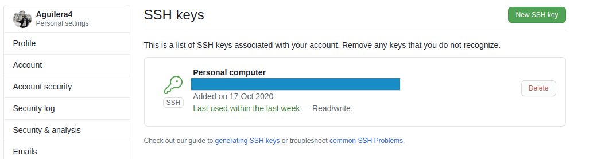
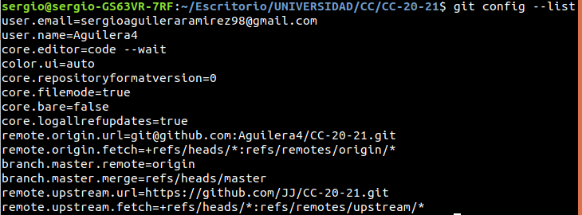
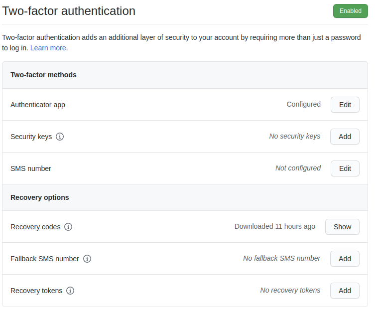

# Configuración Inicial de Git 

### 1- Descarga de git para usarlo desde línea de órdenes

Instalamos la última versión de git en nuestra distribución Linux.

---

### 2- Creación de par de claves y subida de clave pública a GitHub

Se ha configurado git para establecer conexión con el servidor a través de ssh, evitandonos costos de tiempo (ingresando nick y password a través de https). Esto se ha conseguido generando un par de claves en nuestra computadora y subiendo la clave pública a nuestra cuenta de github.

---

### 3- Configuración correcta del nombre y correo electrónico para que aparezca en los commits

Configuramos git con nuestro nombre de usuario y correo electrónico. También podemos ver configuraciones de actualizaciones remotas que se especifican en la documentación.

---

### 4- Edición del perfil de GitHub para que aparezca una imagen en vez del avatar por omisión, nombre completo y ciudad, así como universidad

Establecemos una configuración básica de nuestro perfil.

---

### 5- Incrementar la seguridad de nuestra cuenta en GitHub activando el segundo factor de autenticación

Establecemos el factor de doble autenticación para aportar una mayor seguridad a nuestra cuenta de github. Este proceso se ha realizado con la app *Microsoft Authenticator*.

