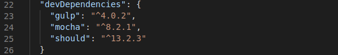

# Biblioteca de aserciones

#### Algunas bibliotecas de aserciones

Estas son algunas de las bibliotecas de aserciones más utilizadas para nodejs (como se especifica en el temario).

- [Chai.js](https://www.chaijs.com/api/bdd/)

- [Must.js](https://github.com/moll/js-must)

- [Should.js](https://github.com/tj/should.js)

#### Comparativa

Existen pocas diferencias entre estas bibliotecas de aserciones más que de su forma de codificación. Navegando por internet no encontré ninguna carácteristica que haga decantarse por alguna en concreto. 

#### Decisión final

Para este proyecto he decidido utilizar la biblioteca shoudl.js ya que varios sitios de información remarcan que esta biblioteca es buena por su gran expresividad y legibilidad, así como permitir un código de prueba limpio. Además, su sistema de mensajes de error es muy útil.

#### Instalación 

Para la instalación de ***should.js*** debemos ejecutar la siguiente sentencia:

`$ npm install should --save-dev `

Esto añadirá a nuestro ***package.json*** la dependendia correspondiente.

#### Información adicional

Should.js [option](http://shouldjs.github.io/)