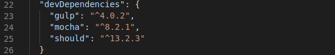

# Marco de pruebas

#### Algunas marcos de pruebas

Algunas opciones que tenemos para utilizar como marco de pruebas son:

- [Mocha](https://mochajs.org/)

- [Jasmine](https://jasmine.github.io/)

#### Comparativa

- Ventajas de Mocha:
    - Simple y flexible.
    - Tests asincronos simples.
    - Permite usar cualquier biblioteca de aserciones.

- Ventajas de Jasmine:
    - Configuración simple.
    - Buena sintaxis fluida para aserciones.

#### Decisión final

Finalmente, vamos ha utilizar el marco de pruebas ***Mocha***. Por su facilidad de utilización e integración con el lenguaje de programación empleado en nuestro proyecto, siendo este ***Nodejs***.

Por otro lado, presenta diversas ventajas sobre el resto de marcos como por ejemplo la admisión del desarrollo impulsado por el comportamiento y el desarrollo impulsado por pruebas (aunque Jasmine también contiene esta característica).

#### Instalación 

En cuanto a la isntalación de mocha en nuestro proyecto, debemos ejecutar el comando `$ npm install mocha --save-dev ` que añadirá la dependencia a nuestro **.json**.

#### Información adicional

[Ventajas](https://www.mindk.com/blog/javascript-testing-framework/#:~:text=Supports%20both%20Behavior%20Driven%20Development,who%20use%20test%2Ddriven%20development.) de Mocha.

[Guía](https://blog.logrocket.com/a-quick-and-complete-guide-to-mocha-testing-d0e0ea09f09d/) utilización de Mocha.