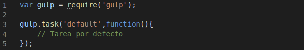

# Gestor de tareas

#### Algunos gestores de tareas

Estas son algunas de las herramientas para la gestion de tareas más populares con respecto a nodejs, aunque cabe destacar que no son la únicas. 

- [Gulp](https://gulpjs.com/docs/en/getting-started/quick-start) 

- [Grunt](https://gruntjs.com/)

#### Grunt vs Gulp

La principal diferencia entre estos gestores es que grunt trabaja directamente sobre los archivos, creandolos de forma temporal (además de almacenarlos localmente) cuando se realiza alguna tarea. En cambio, gulp trabaja en la memoria principal, escribiendo directamente en los archivos, lo que le aporta una mayor velocidad.

Por otro lado, grunt esta más orientado a la configuración de las tareas y gulp se basa en la programación de estas, aportando mayor versatilidad y libertad en cuanto a la especificación de las tareas.

#### Decisión final

Finalmente se ha decido utilizar ***Gulp*** como gestor de tareas. Aunque requiere un mayor esfuerzo de programación, teniendo vista hacia el futuro, las característcas prestadas por esta herramienta hacen que sea la mejor opción.

#### Instalación 

Primero tenemos que instalar **Gulp** en nuestra máquina para ello ejecutar:

`$ npm install --global gulp-cli `

Para la instalación de la dependencia en nuestro **package.json** ejecutar el comando:

`$ npm install --save-dev gulp`

Vemos como queda declarada la dependencia en nuestro **.json**.

Ahora creamos un archivo gulpfile.js en la raíz del directorio el cual contendra todas las tareas que definamos.

#### Información adicional

[Instalación](https://riptutorial.com/es/gulp/example/4376/instalacion-o-configuracion) gulp.
